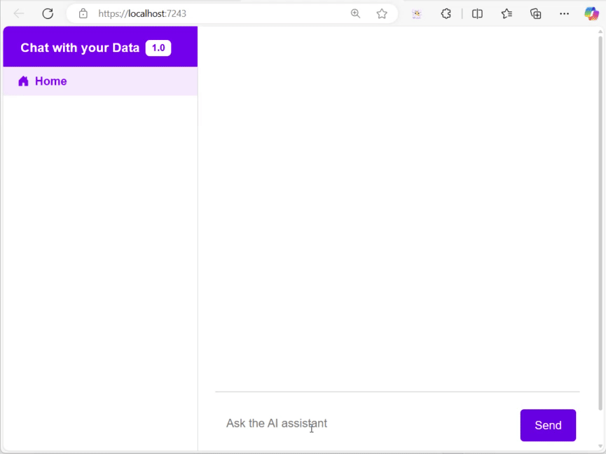
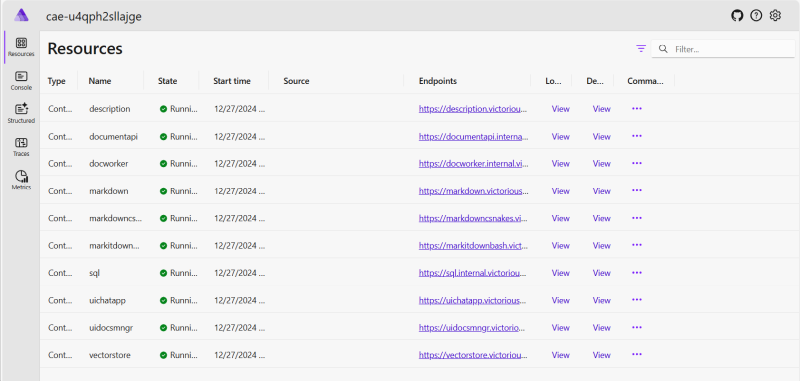
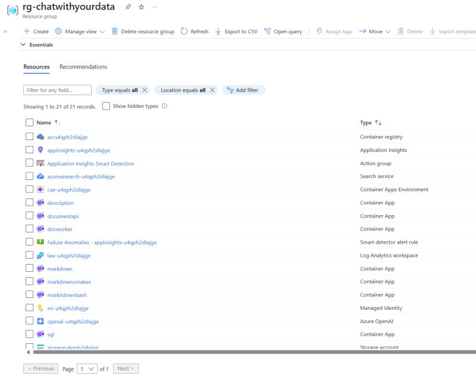
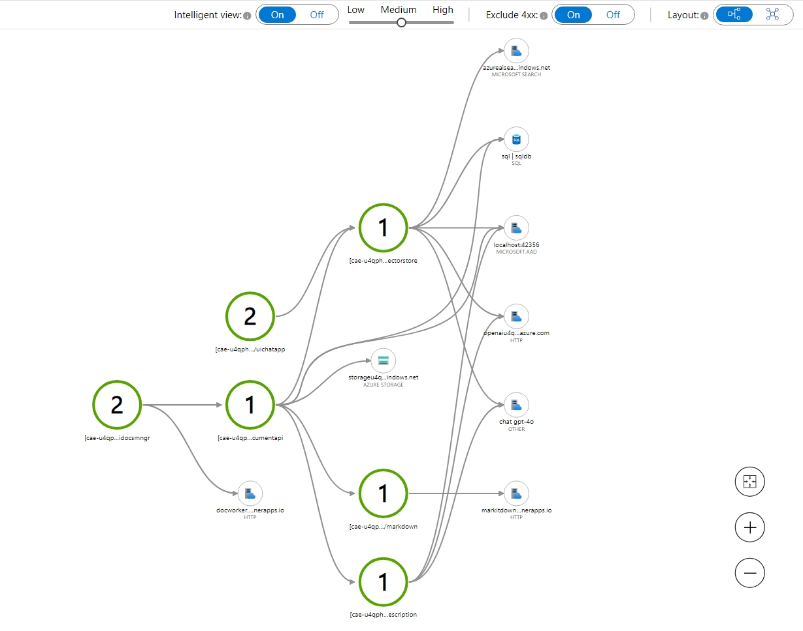
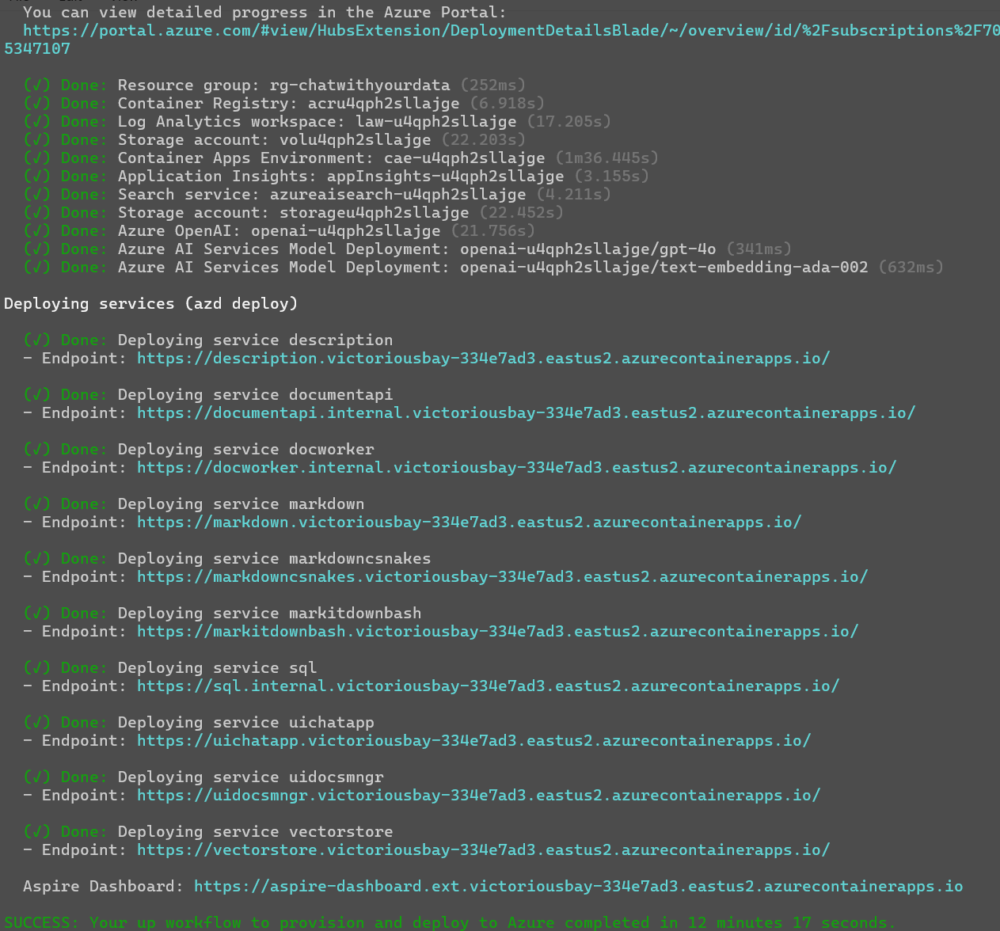
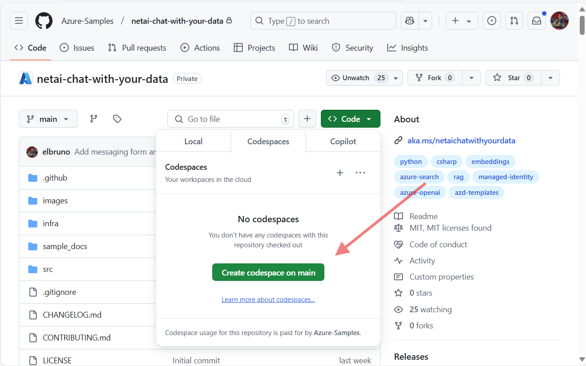

[](/LICENSE)
[](https://twitter.com/elbruno)


## Description

**Chat with your Data** is a reference .NET application implementing an Chat application based on documents content with search features using **Semantic Search with Vector Database and Azure AI Search**.

- [Features](#features)
- [Architecture diagram](#architecture-diagram)
- [Getting started](#getting-started)
- [Deploying to Azure](#deploying)
- Run solution
  - [Run locally](#run-locally)
  - [Run the solution](#run-the-solution)
  - [.NET Aspire Azure Resources creation](#net-aspire-azure-resources-creation)- 
  - [Analyze the Vector Store in Azure AI Search](#analyze-the-vector-store-in-azure-ai-search)
  - [Local dev using existing services](#local-development-using-an-existing-services)
  - [Telemetry with .NET Aspire and Azure Application Insights](#telemetry-with-net-aspire-and-azure-application-insights)
- [Solution Overview](#overview-of-the-solution-functionallity)
- [Resources](#resources)
- [Video Recordings](#video-recordings)
- [Guidance](#guidance)
  - [Costs](#costs)
  - [Security Guidelines](#security-guidelines)
- [Resources](#resources)

## Features

**GitHub CodeSpaces:** This project is designed to be opened in GitHub Codespaces as an easy way for anyone to deploy the solution entirely in the browser.

This is the Chat Application running answering questions based on documents content:



This is the  Document Manager application. this application serves as an example on how to add or update new documents to the document database.


The Aspire Dashboard to check the running services:



The Azure Resource Group with all the deployed services:



The Application Insights Application Map view of the solution:



## Architecture diagram

WIP 

## Getting Started

The solution is in the `./src` folder, the main solution is **[Chat-With-Y-Data.sln](./src/Chat-With-Y-Data.sln)**.

## Deploying

Once you've opened the project in [Codespaces](#github-codespaces), or [locally](#run-locally), you can deploy it to Azure.

From a Terminal window, open the folder with the clone of this repo and run the following commands.

1. Login to Azure:

    ```shell
    azd auth login
    ```

1. Provision and deploy all the resources:

    ```shell
    azd up
    ```

    It will prompt you to provide an `azd` environment name (like "**chat=with-your-data**"), select a subscription from your Azure account, and select a [location where Azure AI Search and the OpenAI models gpt-4o and ADA-002 are available](https://azure.microsoft.com/explore/global-infrastructure/products-by-region/?products=cognitive-services&regions=all) (like "eastus2").

1. When `azd` has finished deploying, you'll see the list of resources created in Azure and a set of URIs in the command output.

1. Visit the **uichatapp** URI, and you should see the **Chat application**! 🎉

1. Visit the **uidocsmngr** URI, and you should see the **Document Manager Application**! 🎉

1. This is an example of the command output:

  

1. **Coming Soon!** You can check this video with a 5 minutes overview of the deploy process from Codespaces: [Deploy Your **Chat with your Data** to Azure in Minutes!]().

***Note:** The deploy files are located in the `./src/ChatWYData.AppHost/infra/` folder. They are generated by the `Aspire AppHost` project.*

### GitHub CodeSpaces

- Create a new  Codespace using the `Code` button at the top of the repository.

  

- The Codespace creation process can take a couple of minutes.

- Once the Codespace is loaded, it should have all the necessary requirements to deploy the solution.

### Run Locally

To run the project locally, you'll need to make sure the following tools are installed:

- [.NET 9](https://dotnet.microsoft.com/downloads/)
- [Git](https://git-scm.com/downloads)
- [Azure Developer CLI (azd)](https://aka.ms/install-azd)
- [Visual Studio Code](https://code.visualstudio.com/Download) or [Visual Studio](https://visualstudio.microsoft.com/downloads/)
  - If using Visual Studio Code, install the [C# Dev Kit](https://marketplace.visualstudio.com/items?itemName=ms-dotnettools.csdevkit)
- .NET Aspire workload:
    Installed with the [Visual Studio installer](https://learn.microsoft.com/en-us/dotnet/aspire/fundamentals/setup-tooling?tabs=windows&pivots=visual-studio#install-net-aspire) or the [.NET CLI workload](https://learn.microsoft.com/en-us/dotnet/aspire/fundamentals/setup-tooling?tabs=windows&pivots=visual-studio#install-net-aspire).
- An OCI compliant container runtime, such as:
  - [Docker Desktop](https://www.docker.com/products/docker-desktop/) or [Podman](https://podman.io/).

### Run the solution

Follow these steps to run the project, locally or in CodeSpaces:

- Navigate to the Aspire Host folder project using the command:

  ```bash
  cd ./src/ChatWYData.AppHost
  ```

- If you are running the project in Codespaces, you need to run this command:

  ```bash
  dotnet dev-certs https --trust
  ```

- By default the AppHost project creates the necessary resources on Azure. Check the **[.NET Aspire Azure Resources creation](#net-aspire-azure-resources-creation)** section to learn how to configure the project to create Azure resources.

- Run the project:

  ```bash
  dotnet run
  ````

Check the [Video Resources](#resources) for a step-by-step on how to run this project.

## .NET Aspire Azure Resources creation

When utilizing Azure resources in your local development environment, you need to:

- Authenticate to the Azure Tenant where the resources will be created. Run the following command to connect with your Azure tenant:

  ```bash
  az login 
  ```
- Provide the necessary Configuration values are specified under the Azure section in the `ChatWYData.AppHost` project:

  - CredentialSource: Delegates to the [AzureCliCredential](https://learn.microsoft.com/dotnet/api/azure.identity.azureclicredential).
  - SubscriptionId: The Azure subscription ID.
  - AllowResourceGroupCreation: A boolean value that indicates whether to create a new resource group.
  - ResourceGroup: The name of the resource group to use.
  - Location: The Azure region to use.

Consider the following example for the *appsettings.json* file in the eShopAppHost project configuration:

```json
{
  "Azure": {
    "CredentialSource": "AzureCli",
    "SubscriptionId": "<Your subscription id>",
    "AllowResourceGroupCreation": true,
    "ResourceGroup": "<Valid resource group name>",
    "Location": "<Valid Azure location>"
  }
}
```

Check [.NET Aspire Azure hosting integrations](https://learn.microsoft.com/en-us/dotnet/aspire/azure/local-provisioning#net-aspire-azure-hosting-integrations) for more information on how .NET Aspire create the necessary cloud resources for local development.

### Analyze the Vector Store in Azure AI Search

Once you upload documents using the **Document Manager Application**, the solution will store the documents information in an Azure AI Search index.


When you use the **Chat Application**, the user questions will be processed and answered using a gpt-4o model, and also the information from the Azure AI Search index.


### Local development using an existing services

In order to use existing **Azure AI Search Services** and existing **Azure OpenAI models**, like gpt-4o and text-embedding-ada-002, you need to make changes in several project:

#### Aspire AppHost

Open the `program.cs` in `.\src\ChatWYData.AppHost\`, and comment the main aspire lines, and uncomment the lines to work in DEV MODE.


#### API Projects

Edit and define specific connection strings in the projects"

- ChatWYData.DescriptionApi
- ChatWYData.VectorStoreAzureAISearch

Add a user secret running these commands in each project. 
In example, for the DescriptionApi project:

```bash
cd src/ChatWYData.DescriptionApi
dotnet user-secrets set "ConnectionStrings:openai" "Endpoint=https://<endpoint>.openai.azure.com/;Key=<Azure OpenAI Service key>;"
dotnet user-secrets set "ConnectionStrings:azureaisearch" "Endpoint=https://<endpoint>.search.windows.net/;Key=<Azure AI Search key>;"
```

### Telemetry with .NET Aspire and Azure Application Insights

The **Chat with your Data solution** leverages the Aspire Dashboard and Azure Application Insights to provide comprehensive telemetry and monitoring capabilities

The **.NET Aspire Dashboard** offers a centralized view of the application's performance, health, and usage metrics. It integrates seamlessly with the Azure OpenAI services, allowing developers to monitor the performance of the `gpt-4o` and `text-embedding-ada-002` models. The dashboard provides real-time insights into the application's behavior, helping to identify and resolve issues quickly.


**Azure Application Insights** complements the Aspire Dashboard by offering deep diagnostic capabilities and advanced analytics. It collects detailed telemetry data, including request rates, response times, and failure rates, enabling developers to understand how the application is performing under different conditions. Application Insights also provides powerful querying and visualization tools, making it easier to analyze trends and detect anomalies.


By combining the Aspire Dashboard with Azure Application Insights, the eShopLite solution ensures robust monitoring and diagnostics, enhancing the overall reliability and performance of the application.

## Overview of the Solution functionallity

### Upload Document

When a new document is uploaded, the document is processed and marked ready to process. The `/filebatch/upload` endpoint in the `.\src\ChatWYData.DocumentsApi\EndPoints\FileBatchEndpoints.cs` file handles the uploading of files and their processing for storage and further operations. Here is a high-level overview of its functionality:

- Document Initialization. Creates a new Document object with the file name and content type from the upload request.
- Upload the file to Azure Blob Storage.
  - Checks if the file already exists in the blob storage and updates it if necessary.
- Update Process Batch Queue. Checks if a FileProcessBatch entry already exists for the file.
- Saves the changes to the database.
- Return Response

### Process an Uploaded Document

The `/filebatch/processdoc` endpoint in the `.\src\ChatWYData.DocumentsApi\EndPoints\FileBatchEndpoints.cs` file handles the processing of uploaded documents.

Here is a high-level overview of its functionality:

- Retrieve File Batch from Database. Fetches the FileProcessBatch entry for the given file name from the database.
- Download File from Blob Storage. Retrieves the file content from Azure Blob Storage using the Blob URI.
- Search or Create Document in Database
- Generate Markdown Content
    - Converts the file content to Markdown using the MarkdownApiService.
    - Updates the document with the generated Markdown content.
    - ***Important:** in Windows development, the app uses the `ChatWYData.MarkDown.MarkitdownCSnakes` project to generate the markdown content. When the app is running on Linux (like when deployed to Azure)m the app uses `ChatWYData.MarkDown.MarkitdownBashApi` to generate the markdown content.*
- Upsert Document in Vector Store. Adds the document to the vector store using the VectorStoreApiService.
- Generate Document Description. Generates a description for the document using the DescriptionApiService.
- Update Database with Document Information
- Complete Processing. Returns the response object.

This endpoint ensures that documents are processed, converted to Markdown, added to the vector store, described, and updated in the database, providing a comprehensive workflow for document management.

```mermaid
stateDiagram
    [*] --> StartProcessing: Start processing document
    StartProcessing --> RetrieveFileBatch: Retrieve file batch from database
    RetrieveFileBatch --> FileBatchNotFound: File batch not found
    RetrieveFileBatch --> UpdateStatusStart: Update status to "starting process"
    UpdateStatusStart --> DownloadFile: Download file from blob storage
    DownloadFile --> SearchOrCreateDocument: Search or create document in database
    SearchOrCreateDocument --> UpdateStatusSaved: Update status to "document saved to database"
    UpdateStatusSaved --> GenerateMarkdown: Generate Markdown content
    GenerateMarkdown --> UpdateStatusMarkdown: Update status to "document markdown generated"
    UpdateStatusMarkdown --> UpsertVectorStore: Upsert document in vector store
    UpsertVectorStore --> UpdateStatusVector: Update status to "vector store document information saved"
    UpdateStatusVector --> GenerateDescription: Generate document description
    GenerateDescription --> UpdateStatusDescription: Update status to "document description generated"
    UpdateStatusDescription --> SaveOrUpdateDatabase: Save or update document in database
    SaveOrUpdateDatabase --> UpdateStatusDone: Update status to "document updated in the database"
    UpdateStatusDone --> CompleteProcessing: Update status to "done"
    CompleteProcessing --> [*]: Return response
```

### Chat steps for each question

Each conversation in the Chat App:

- Initialize Response
  - Generate a query for Azure AI Search.
  - Generate an embedding for the search query.
- Search
  - Define search options like maximum results and vector property name.
  - Execute a vectorized search on the document collection.
  - Filter and collect documents based on the minimum score.
- Generate Response Message:
  - If documents are found, generate a friendly response message.
  - If no documents are found, generate a response from the user's query.
- Return Response


## Guidance

### Costs

For **Azure OpenAI Services**, pricing varies per region and usage, so it isn't possible to predict exact costs for your usage. Same applies to **Azure AI Search**.
The majority of the Azure resources used in this infrastructure are on usage-based pricing tiers.
However, Azure Container Registry has a fixed cost per registry per day.

You can try the [Azure pricing calculator](https://azure.com/e/2176802ea14941e4959eae8ad335aeb5) for the resources:

- Azure OpenAI Service: S0 tier, gpt-4o and text-embedding-ada-002 models. Pricing is based on token count. [Pricing](https://azure.microsoft.com/pricing/details/cognitive-services/openai-service/)
- Azure Container App: Consumption tier with 0.5 CPU, 1GiB memory/storage. Pricing is based on resource allocation, and each month allows for a certain amount of free usage. [Pricing](https://azure.microsoft.com/pricing/details/container-apps/)
- Azure Container Registry: Basic tier. [Pricing](https://azure.microsoft.com/pricing/details/container-registry/)
- Log analytics: Pay-as-you-go tier. Costs based on data ingested. [Pricing](https://azure.microsoft.com/pricing/details/monitor/)
- Azure AI Search: [Basic tier](https://azure.microsoft.com/pricing/details/search/). You can edit the bicep files to change for the free tier.
- Azure Application Insights pricing is based on a Pay-As-You-Go model. [Pricing](https://learn.microsoft.com/azure/azure-monitor/logs/cost-logs).

⚠️ To avoid unnecessary costs, remember to take down your app if it's no longer in use, either by deleting the resource group in the Portal or running `azd down`.

### Security Guidelines

Samples in this templates uses Azure OpenAI Services with ApiKey and [Managed Identity](https://learn.microsoft.com/entra/identity/managed-identities-azure-resources/overview) for authenticating to the Azure OpenAI service.

The Main Sample uses Managed Identity](https://learn.microsoft.com/entra/identity/managed-identities-azure-resources/overview) for authenticating to the Azure OpenAI service.

Additionally, we have added a [GitHub Action](https://github.com/microsoft/security-devops-action) that scans the infrastructure-as-code files and generates a report containing any detected issues. To ensure continued best practices in your own repository, we recommend that anyone creating solutions based on our templates ensure that the [Github secret scanning](https://docs.github.com/code-security/secret-scanning/about-secret-scanning) setting is enabled.

You may want to consider additional security measures, such as:

- Protecting the Azure Container Apps instance with a [firewall](https://learn.microsoft.com/azure/container-apps/waf-app-gateway) and/or [Virtual Network](https://learn.microsoft.com/azure/container-apps/networking?tabs=workload-profiles-env%2Cazure-cli).

## Resources

- [eShopLite Semantic Search](https://aka.ms/netaieshoplitesemanticsearch) is a reference .NET application implementing an eCommerce site with Search features using Keyword Search and Semantic Search.

- [eShopLite Semantic Search Azure AI Search](https://aka.ms/netaieshoplitesemanticsearchazureaisearch) is a reference .NET application implementing an eCommerce site with Search features using Keyword Search and Semantic Search with Azure AI Search.

- [Deploy a .NET Aspire project to Azure Container Apps using the Azure Developer CLI (in-depth guide)](https://learn.microsoft.com/dotnet/aspire/deployment/azure/aca-deployment-azd-in-depth)

- [Aspiring .NET Applications with Azure OpenAI](https://learn.microsoft.com/shows/azure-developers-dotnet-aspire-day-2024/aspiring-dotnet-applications-with-azure-openai)

